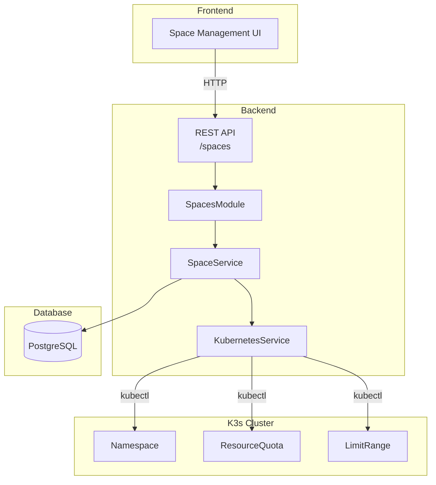
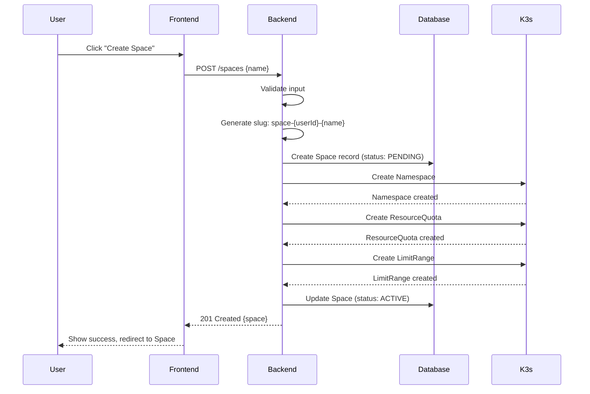
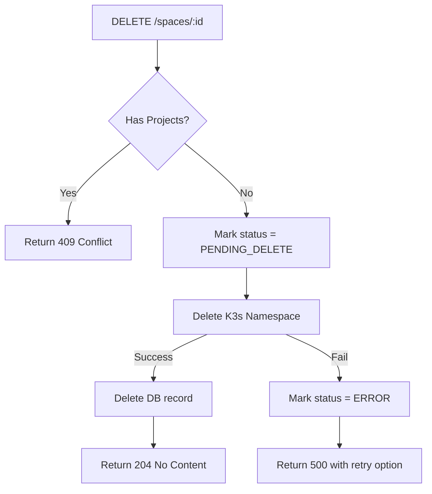

# Thiết kế Hệ thống & Kiến trúc

## Tổng quan Kiến trúc

**Cấu trúc hệ thống cấp cao là gì?**

Space là đơn vị tổ chức cấp cao nhất trong hệ thống, mỗi Space tương ứng với một K3s Namespace để đảm bảo isolation giữa các tài nguyên. K3s là lightweight Kubernetes distribution, tuân thủ đầy đủ Kubernetes API chuẩn nên chúng ta sử dụng `@kubernetes/client-node` như bình thường.



### Luồng Tạo Space



## Mô hình Dữ liệu

**Chúng ta cần quản lý dữ liệu gì?**

### Prisma Schema (đã có trong schema.prisma)

```prisma
model Space {
  id          String  @id @default(cuid())
  name        String
  slug        String  @unique // K3s namespace name: space-{userId}-{spaceName}
  description String?

  // Owner
  userId String
  user   User   @relation(fields: [userId], references: [id], onDelete: Cascade)

  // Resource Quotas (K3s ResourceQuota - compatible with K8s standard)
  cpuLimit     String @default("2")     // Total CPU cores (e.g., "500m", "2")
  memoryLimit  String @default("2Gi")   // Total memory (e.g., "512Mi", "2Gi")
  storageLimit String @default("10Gi")  // Total storage

  // Relations
  projects Project[]

  createdAt DateTime @default(now())
  updatedAt DateTime @updatedAt

  @@index([userId])
}
```

### Thêm SpaceStatus (đề xuất thêm vào schema)

```prisma
enum SpaceStatus {
  PENDING         // Đang tạo K3s resources
  ACTIVE          // Sẵn sàng sử dụng
  PENDING_DELETE  // Đang xóa K3s resources
  ERROR           // Tạo/xóa thất bại
}

model Space {
  // ... existing fields
  status SpaceStatus @default(PENDING)
  statusMessage String? // Error message if status = ERROR
}
```

### Tier Quotas Configuration

| Tier | CPU Limit | Memory Limit | Storage Limit | Max Spaces |
| :--- | :-------- | :----------- | :------------ | :--------- |
| FREE | 500m      | 512Mi        | 1Gi           | 3          |
| PRO  | 2         | 2Gi          | 10Gi          | 10         |
| TEAM | 8         | 8Gi          | 50Gi          | Unlimited  |

## Thiết kế API

**Các thành phần giao tiếp như thế nào?**

### REST API Endpoints

| Method   | Endpoint            | Mô tả                                    | Auth         |
| :------- | :------------------ | :--------------------------------------- | :----------- |
| `POST`   | `/spaces`           | Tạo Space mới                            | Bearer Token |
| `GET`    | `/spaces`           | Lấy danh sách Spaces của user            | Bearer Token |
| `GET`    | `/spaces/:id`       | Lấy chi tiết Space (bao gồm quota usage) | Bearer Token |
| `PATCH`  | `/spaces/:id`       | Cập nhật Space (name, description)       | Bearer Token |
| `DELETE` | `/spaces/:id`       | Xóa Space (chỉ khi trống)                | Bearer Token |
| `GET`    | `/spaces/:id/quota` | Lấy quota usage từ K8s                   | Bearer Token |

### Request/Response Formats

#### POST /spaces

**Request:**

```json
{
  "name": "my-project",
  "description": "My first project space"
}
```

**Response (201 Created):**

```json
{
  "data": {
    "id": "cuid...",
    "name": "my-project",
    "slug": "space-usr123-my-project",
    "description": "My first project space",
    "status": "ACTIVE",
    "cpuLimit": "500m",
    "memoryLimit": "512Mi",
    "storageLimit": "1Gi",
    "createdAt": "2025-01-15T10:00:00Z"
  }
}
```

**Error Response (400 Bad Request):**

```json
{
  "statusCode": 400,
  "error": "Bad Request",
  "message": "Đã đạt giới hạn số lượng Space cho tier FREE (tối đa 3)",
  "code": "SPACE_QUOTA_EXCEEDED"
}
```

#### GET /spaces

**Response:**

```json
{
  "data": [
    {
      "id": "cuid...",
      "name": "my-project",
      "slug": "space-usr123-my-project",
      "description": "My first project space",
      "status": "ACTIVE",
      "projectCount": 2,
      "cpuLimit": "500m",
      "memoryLimit": "512Mi",
      "storageLimit": "1Gi",
      "createdAt": "2025-01-15T10:00:00Z"
    }
  ],
  "meta": {
    "total": 1,
    "page": 1,
    "limit": 20
  }
}
```

#### GET /spaces/:id/quota

**Response:**

```json
{
  "data": {
    "cpu": {
      "used": "100m",
      "limit": "500m",
      "percentage": 20
    },
    "memory": {
      "used": "128Mi",
      "limit": "512Mi",
      "percentage": 25
    },
    "storage": {
      "used": "256Mi",
      "limit": "1Gi",
      "percentage": 25
    }
  }
}
```

#### DELETE /spaces/:id

**Error Response (409 Conflict):**

```json
{
  "statusCode": 409,
  "error": "Conflict",
  "message": "Không thể xóa Space vì còn 2 Projects bên trong",
  "code": "SPACE_DELETE_HAS_PROJECTS",
  "details": {
    "projectCount": 2
  }
}
```

## Phân rã Thành phần

**Các khối xây dựng chính là gì?**

### Backend Components

```
backend/src/modules/spaces/
├── spaces.module.ts           # NestJS module
├── spaces.controller.ts       # HTTP endpoints
├── spaces.service.ts          # Business logic
├── dto/
│   ├── create-space.dto.ts    # Validation cho POST
│   ├── update-space.dto.ts    # Validation cho PATCH
│   └── space-response.dto.ts  # Response format
└── interfaces/
    └── space-quota.interface.ts  # Quota types

backend/src/kubernetes/
├── kubernetes.module.ts       # Global module
├── kubernetes.service.ts      # K8s client wrapper
└── builders/
    ├── namespace.builder.ts   # Build Namespace manifest
    ├── resource-quota.builder.ts  # Build ResourceQuota
    └── limit-range.builder.ts # Build LimitRange
```

### Frontend Components

```
frontend/src/
├── features/spaces/
│   ├── api/
│   │   └── spaces.api.ts      # API calls
│   ├── hooks/
│   │   ├── use-spaces.ts      # React Query hooks
│   │   └── use-space.ts
│   └── components/
│       ├── space-list.tsx     # List view
│       ├── space-card.tsx     # Card component
│       ├── create-space-dialog.tsx
│       └── space-quota-bar.tsx
├── app/(dashboard)/spaces/
│   ├── page.tsx               # Spaces list page
│   └── [id]/
│       └── page.tsx           # Space detail page
```

## K3s Resources

**K3s resources được tạo cho mỗi Space:**

> **Note:** K3s là certified Kubernetes distribution, hỗ trợ đầy đủ các resources như Namespace, ResourceQuota, LimitRange.

### Namespace

```yaml
apiVersion: v1
kind: Namespace
metadata:
  name: space-usr123-my-project
  labels:
    app.kubernetes.io/managed-by: paas-k3s
    paas.io/owner: usr123
    paas.io/type: space
    paas.io/space-id: cuid...
```

### ResourceQuota (Free Tier)

```yaml
apiVersion: v1
kind: ResourceQuota
metadata:
  name: space-quota
  namespace: space-usr123-my-project
  labels:
    app.kubernetes.io/managed-by: paas-k3s
spec:
  hard:
    requests.cpu: "500m"
    requests.memory: "512Mi"
    limits.cpu: "500m"
    limits.memory: "512Mi"
    requests.storage: "1Gi"
    persistentvolumeclaims: "3"
    pods: "10"
    services: "5"
```

### LimitRange (Default limits cho Pods)

```yaml
apiVersion: v1
kind: LimitRange
metadata:
  name: default-limits
  namespace: space-usr123-my-project
spec:
  limits:
    - default:
        cpu: "100m"
        memory: "128Mi"
      defaultRequest:
        cpu: "50m"
        memory: "64Mi"
      type: Container
```

## Quyết định Thiết kế

**Tại sao chúng ta chọn cách tiếp cận này?**

| Quyết định                           | Lý do                                           | Alternatives considered                    |
| :----------------------------------- | :---------------------------------------------- | :----------------------------------------- |
| 1 Space = 1 Namespace                | Isolation hoàn toàn về network, resources, RBAC | Virtual clusters (overkill for MVP)        |
| Slug format: `space-{userId}-{name}` | Unique globally, easy to trace owner            | UUID-only (harder to debug)                |
| ResourceQuota per Namespace          | K3s/K8s native, enforced at cluster level       | Application-level tracking (less reliable) |
| LimitRange for defaults              | Prevent pods without limits consuming too much  | Manual limits (error-prone)                |
| Status field in DB                   | Track async K3s operations                      | Polling K3s directly (slower)              |

## Xử lý Lỗi & Edge Cases

### Rollback Strategy

Nếu tạo K3s resources thất bại:

1. Mark Space status = ERROR
2. Store error message in statusMessage
3. Cho phép user retry hoặc delete

### Deletion Flow



## Cân nhắc Bảo mật

- **Authorization:** User chỉ có thể CRUD spaces của chính mình (trừ ADMIN).
- **Slug injection:** Sanitize tên Space, chỉ cho phép `[a-z0-9-]`.
- **K3s RBAC:** Backend service account cần quyền create/delete Namespace, ResourceQuota, LimitRange trong K3s cluster.

## Non-Functional Requirements

| Yêu cầu           | Target                                              |
| :---------------- | :-------------------------------------------------- |
| Response time     | < 500ms cho list/detail, < 2s cho create (K3s call) |
| Availability      | 99.5% uptime                                        |
| Concurrent users  | 100 users đồng thời                                 |
| Quota enforcement | Real-time từ K3s API                                |
