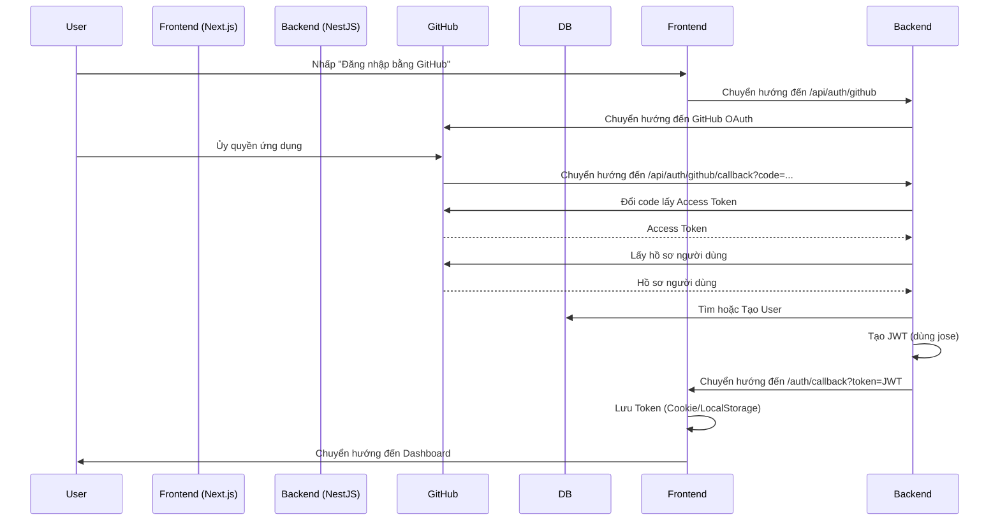

# Thiết kế Hệ thống & Kiến trúc

## Tổng quan Kiến trúc
**Cấu trúc hệ thống cấp cao là gì?**

Chúng ta sẽ sử dụng **Luồng OAuth tập trung tại Backend** để giữ logic xác thực tập trung và an toàn.



- **Frontend:** Chịu trách nhiệm bắt đầu đăng nhập và lưu trữ JWT được trả về.
- **Backend:** Xử lý bắt tay OAuth, tạo/tìm kiếm người dùng và phát hành JWT (sử dụng thư viện `jose`).

## Mô hình Dữ liệu
**Chúng ta cần quản lý dữ liệu gì?**

Chúng ta sẽ sử dụng model `User` hiện có trong `schema.prisma`.

```prisma
model User {
  id            String    @id @default(cuid())
  email         String    @unique
  username      String    @unique // GitHub username
  name          String?   // GitHub display name
  avatarUrl     String?   // GitHub avatar
  githubId      String    @unique // GitHub numeric ID
  role          UserRole  @default(USER)
  createdAt     DateTime  @default(now())
  updatedAt     DateTime  @updatedAt
  
  // Relations
  spaces        Space[]
}

enum UserRole {
  USER
  ADMIN
}
```

## Thiết kế API
**Các thành phần giao tiếp như thế nào?**

### Các Endpoint Xác thực

| Phương thức | Endpoint | Mô tả | Yêu cầu Auth |
| :--- | :--- | :--- | :--- |
| `GET` | `/auth/github` | Bắt đầu luồng GitHub OAuth | Không |
| `GET` | `/auth/github/callback` | Callback từ GitHub, chuyển hướng về Frontend | Không |
| `GET` | `/auth/me` | Trả về hồ sơ người dùng hiện tại | **Có** (Bearer Token) |

### Định dạng Request/Response

**GET /auth/me**
```json
{
  "id": "cuid...",
  "email": "user@example.com",
  "username": "githubuser",
  "role": "USER",
  "avatarUrl": "..."
}
```

## Phân rã Thành phần
**Các khối xây dựng chính là gì?**

### Backend
- **AuthModule:** Module chính cho xác thực.
- **GithubStrategy:** Kế thừa `PassportStrategy(Strategy, 'github')`.
- **JwtAuthGuard:** Guard tùy chỉnh sử dụng `jose` để xác minh token từ header Authorization.
- **AuthService:** Xử lý logic `validateUser` (tìm/tạo) và `login` (ký JWT bằng `jose`).
- **AuthController:** Expose các endpoint.

### Frontend
- **LoginPage:** `/login` với nút bấm.
- **AuthCallbackPage:** `/auth/callback` để bắt token từ URL query.
- **AuthProvider:** React Context để quản lý trạng thái `user` và `isAuthenticated`.
- **ApiClient:** Axios instance với interceptor để gắn `Authorization: Bearer ...`.

## Quyết định Thiết kế
**Tại sao chúng ta chọn cách tiếp cận này?**

- **Backend-centric OAuth:** Được chọn thay vì Frontend-only (ví dụ: NextAuth) để đảm bảo Backend có toàn quyền kiểm soát phiên người dùng và dễ dàng hỗ trợ các client khác (CLI, Mobile) trong tương lai.
- **JWT với jose:** Sử dụng thư viện `jose` thay vì `@nestjs/jwt` để có hiệu suất tốt hơn, tuân thủ chuẩn Web Crypto API và không phụ thuộc vào module JWT của NestJS, giúp code linh hoạt hơn (có thể chạy trên Edge runtime nếu cần).
- **Prisma:** Truy cập cơ sở dữ liệu an toàn kiểu dữ liệu đảm bảo tính toàn vẹn dữ liệu.

## Cân nhắc Bảo mật
- **JWT Secret:** Phải mạnh và được lưu trong `.env`.
- **Lưu trữ Token:** Frontend nên lưu trữ token an toàn. Cho MVP, `localStorage` hoặc `Cookies` (truy cập được bằng JS) là chấp nhận được, nhưng `HttpOnly` cookies tốt hơn để chống XSS. *Quyết định: Sử dụng `js-cookie` để dễ truy cập trong API client, nhưng có kế hoạch chuyển sang HttpOnly cookies trong giai đoạn Nâng cao.*
- **HTTPS:** Production phải sử dụng HTTPS để bảo vệ token.
