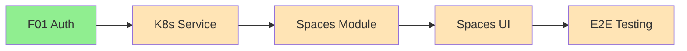

# Kế hoạch Dự án & Phân chia Công việc

## 📊 Tóm Tắt Tiến Độ

**Trạng thái chung:** Chưa bắt đầu

**Phụ thuộc đã hoàn thành:**

- ✅ F01 - User Authentication (Backend 100%, Frontend pending)

**Tiếp theo (Ưu tiên):**

- 🔄 Phase 1: Thiết lập K3s Service
- Phase 2: Backend Spaces Module
- Phase 3: Frontend UI

## Các cột mốc

**Các điểm kiểm tra chính là gì?**

- [ ] **Milestone 1: K3s Integration Foundation** - KubernetesService hoạt động với K3s cluster, có thể tạo/xóa Namespace
- [ ] **Milestone 2: Backend Spaces API** - CRUD endpoints hoàn chỉnh với validation
- [ ] **Milestone 3: Frontend Spaces UI** - List, Create, Delete UI hoàn chỉnh
- [ ] **Milestone 4: End-to-End Testing** - Luồng tạo Space từ UI đến K3s hoạt động

## Phân chia Nhiệm vụ

**Công việc cụ thể nào cần được thực hiện?**

### Giai đoạn 1: K3s Service Foundation (2-3 giờ)

- [ ] **Task 1.1: Cài đặt Dependencies**

  - Cài đặt `@kubernetes/client-node`
  - Cấu hình KUBECONFIG trong `.env`

- [ ] **Task 1.2: Triển khai KubernetesModule**

  - Tạo `kubernetes.module.ts` (Global module)
  - Export `KubernetesService`

- [ ] **Task 1.3: Triển khai KubernetesService Core**
  ```typescript
  // Các methods cần implement:
  - getClient(): CoreV1Api  // K8s client
  - createNamespace(name: string, labels: Record<string, string>)
  - deleteNamespace(name: string)
  - getNamespace(name: string)
  - createResourceQuota(namespace: string, spec: ResourceQuotaSpec)
  - getResourceQuotaUsage(namespace: string)
  - createLimitRange(namespace: string, spec: LimitRangeSpec)
  ```

````

- [ ] **Task 1.4: Tạo Namespace Builder**

  - `builders/namespace.builder.ts`
  - Fluent API để build Namespace manifest

- [ ] **Task 1.5: Tạo ResourceQuota Builder**

  - `builders/resource-quota.builder.ts`
  - Support các tier quotas (FREE, PRO, TEAM)

- [ ] **Task 1.6: Tạo LimitRange Builder**

  - `builders/limit-range.builder.ts`
  - Default container limits

- [ ] **Task 1.7: Unit Tests cho KubernetesService**
  - Mock `@kubernetes/client-node`
  - Test các scenarios: success, namespace already exists, deletion
  - Note: K3s sử dụng Kubernetes API chuẩn nên client hoạt động giống hệt

### Giai đoạn 2: Backend Spaces Module (3-4 giờ)

- [ ] **Task 2.1: Cập nhật Prisma Schema**

  - Thêm `status` và `statusMessage` vào model Space
  - Tạo enum `SpaceStatus`
  - Run `prisma migrate dev`

- [ ] **Task 2.2: Tạo SpacesModule Structure**

  ```
  modules/spaces/
  ├── spaces.module.ts
  ├── spaces.controller.ts
  ├── spaces.service.ts
  ├── dto/
  │   ├── create-space.dto.ts
  │   ├── update-space.dto.ts
  │   └── space-response.dto.ts
  └── interfaces/
      └── space-quota.interface.ts
  ```

- [ ] **Task 2.3: Triển khai DTOs**

  - `CreateSpaceDto`: name (required), description (optional)
  - `UpdateSpaceDto`: name, description (all optional)
  - Validation: name pattern `^[a-z][a-z0-9-]*$`, length 3-50

- [ ] **Task 2.4: Triển khai SpacesService**

  - `create()`: Validate quota, create DB record, create K3s resources
  - `findAll()`: List user's spaces with projectCount
  - `findOne()`: Get space detail
  - `update()`: Update name/description
  - `remove()`: Check no projects, delete K3s resources, delete DB record
  - `getQuotaUsage()`: Get quota from K3s API

- [ ] **Task 2.5: Triển khai SpacesController**

  - CRUD endpoints với proper decorators
  - `@UseGuards(JwtAuthGuard)`
  - `@User()` decorator để lấy current user

- [ ] **Task 2.6: Tạo Slug Utility**

  - `generateSpaceSlug(userId: string, spaceName: string): string`
  - Format: `space-{userId-prefix}-{spaceName}`
  - Đảm bảo <= 63 chars (Kubernetes/K3s namespace limit)

- [ ] **Task 2.7: Tạo Tier Quota Config**

  - `config/tier-quotas.config.ts`
  - Define quotas cho FREE, PRO, TEAM

- [ ] **Task 2.8: Unit Tests cho SpacesService**

  - Test all CRUD operations
  - Test quota exceeded scenario
  - Test delete with projects scenario
  - Mock KubernetesService và PrismaService

- [ ] **Task 2.9: Unit Tests cho SpacesController**
  - Test authorization
  - Test validation errors
  - Test response format

### Giai đoạn 3: Frontend Spaces UI (3-4 giờ)

- [ ] **Task 3.1: Tạo Spaces API Client**

  - `features/spaces/api/spaces.api.ts`
  - CRUD functions với axios

- [ ] **Task 3.2: Tạo React Query Hooks**

  - `useSpaces()`: List spaces
  - `useSpace(id)`: Get single space
  - `useCreateSpace()`: Mutation
  - `useUpdateSpace()`: Mutation
  - `useDeleteSpace()`: Mutation
  - `useSpaceQuota(id)`: Quota usage

- [ ] **Task 3.3: Tạo Spaces List Page**

  - `/app/(dashboard)/spaces/page.tsx`
  - Grid layout với Space cards
  - Empty state khi chưa có spaces
  - Create button

- [ ] **Task 3.4: Tạo SpaceCard Component**

  - Hiển thị name, description, project count
  - Quota usage progress bar
  - Edit/Delete actions dropdown

- [ ] **Task 3.5: Tạo CreateSpaceDialog Component**

  - Modal với form (name, description)
  - Validation feedback
  - Loading state

- [ ] **Task 3.6: Tạo SpaceQuotaBar Component**

  - Progress bar cho CPU, Memory, Storage
  - Color coding: green < 70%, yellow 70-90%, red > 90%

- [ ] **Task 3.7: Tạo Space Detail Page**

  - `/app/(dashboard)/spaces/[id]/page.tsx`
  - Space info header
  - Quota usage panel
  - Projects list (empty for now)
  - Settings panel (rename, delete)

- [ ] **Task 3.8: Frontend Tests**
  - Component tests cho critical UI
  - Hook tests với mock API

### Giai đoạn 4: Integration & Testing (1-2 giờ)

- [ ] **Task 4.1: Integration Tests**

  - E2E test: Create Space flow
  - E2E test: Delete Space flow
  - Test K3s resources actually created in cluster

- [ ] **Task 4.2: Error Handling Improvements**

  - Toast notifications cho success/error
  - Retry UI cho failed K8s operations

- [ ] **Task 4.3: Documentation**
  - Update API docs
  - Update README với Spaces feature

## Sự phụ thuộc

**Điều gì cần xảy ra theo thứ tự nào?**



**Blockers:**

- K3s cluster phải accessible từ backend
- KUBECONFIG phải được cấu hình đúng (mặc định K3s: `/etc/rancher/k3s/k3s.yaml`)

**Thứ tự bắt buộc:**

1. KubernetesService phải hoàn thành trước SpacesService
2. Backend API phải hoàn thành trước Frontend

## Thời gian & Ước tính

**Khi nào mọi thứ sẽ hoàn thành?**

| Giai đoạn              | Thời gian | Tích lũy |
| :--------------------- | :-------- | :------- |
| K3s Service Foundation | 2-3 giờ   | 2-3 giờ  |
| Backend Spaces Module  | 3-4 giờ   | 5-7 giờ  |
| Frontend Spaces UI     | 3-4 giờ   | 8-11 giờ |
| Integration & Testing  | 1-2 giờ   | 9-13 giờ |

**Tổng ước tính:** 9-13 giờ (2-3 ngày làm việc)

## Rủi ro & Giảm thiểu

**Điều gì có thể sai sót?**

| Rủi ro                       | Xác suất   | Tác động   | Giảm thiểu                                         |
| :--------------------------- | :--------- | :--------- | :------------------------------------------------- |
| K3s cluster không accessible | Trung bình | Cao        | Setup mock K3s cho dev, test riêng K3s integration |
| Namespace creation timeout   | Thấp       | Trung bình | Implement retry logic với exponential backoff      |
| ResourceQuota not enforced   | Thấp       | Thấp       | Verify quota via K3s API sau khi create            |
| CORS issues Frontend-Backend | Thấp       | Thấp       | Đã config CORS ở F01                               |

## Tài nguyên cần thiết

**Chúng ta cần gì để thành công?**

- **K8s Cluster:** K3s local hoặc remote (đã có)
- **KUBECONFIG:** File kubeconfig với quyền create Namespace, ResourceQuota
- **Dependencies:**
  - `@kubernetes/client-node` (backend)
  - shadcn/ui components: Dialog, Card, Progress (frontend)

## Definition of Done

Feature được coi là hoàn thành khi:

- [ ] User có thể tạo Space từ UI
- [ ] K3s Namespace được tạo với đúng labels
- [ ] ResourceQuota và LimitRange được áp dụng trong K3s cluster
- [ ] User có thể xem danh sách Spaces với quota usage
- [ ] User có thể đổi tên Space
- [ ] User có thể xóa Space trống
- [ ] Tất cả unit tests pass (target: 100% coverage cho service layer)
- [ ] Không có lint errors
- [ ] Documentation cập nhật

```

```
````
